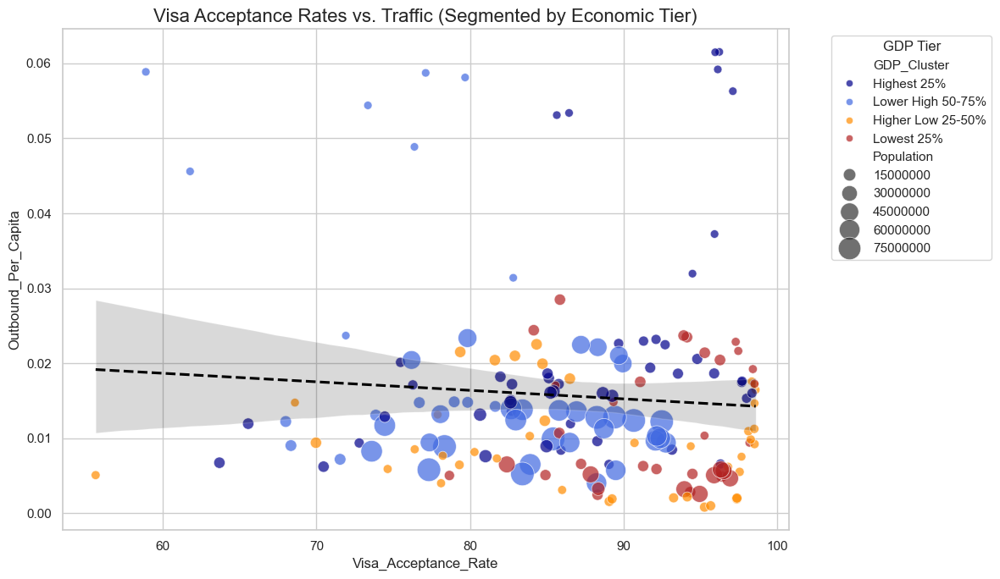
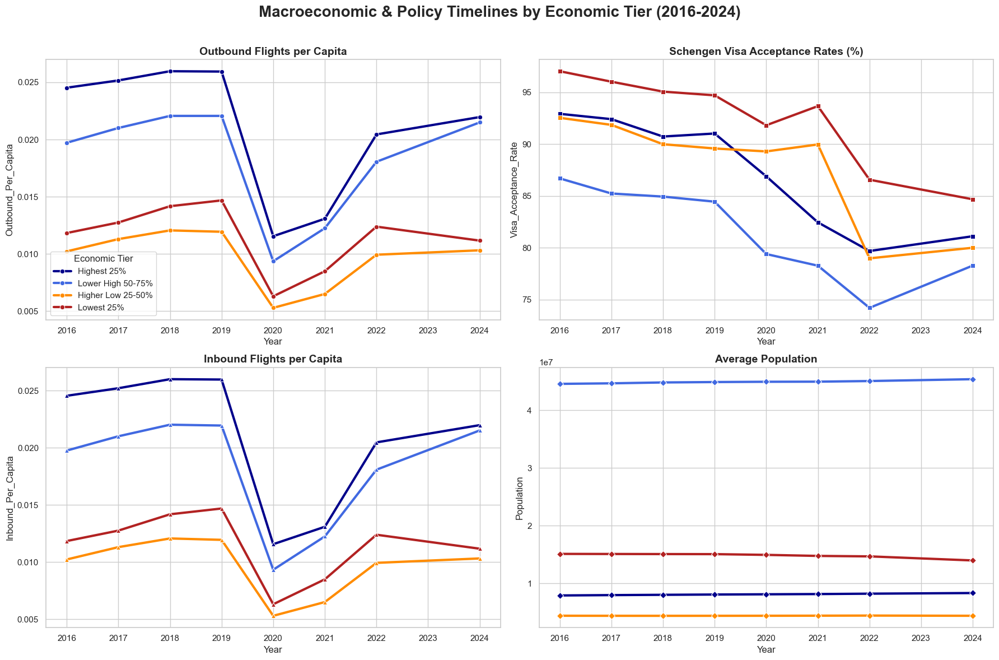
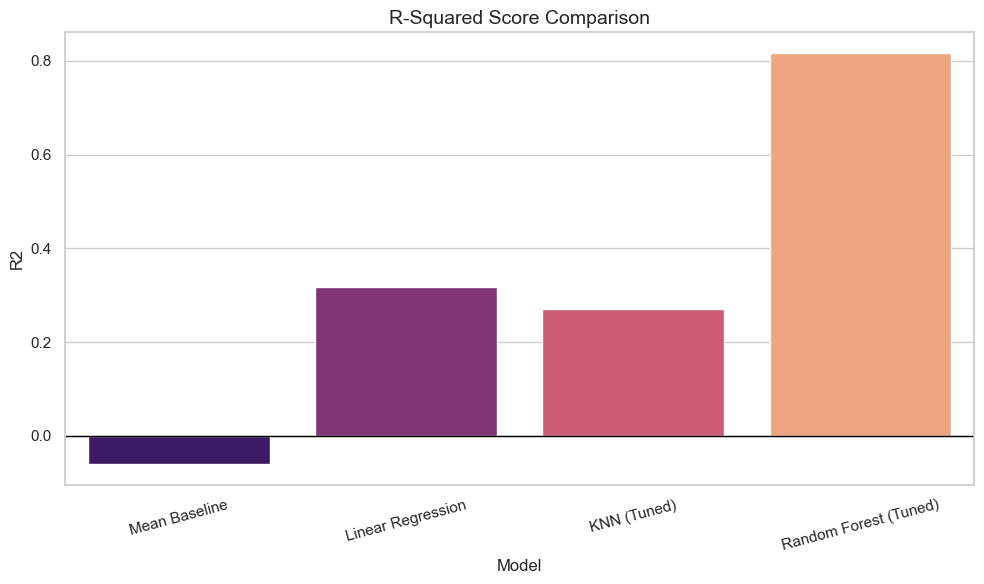
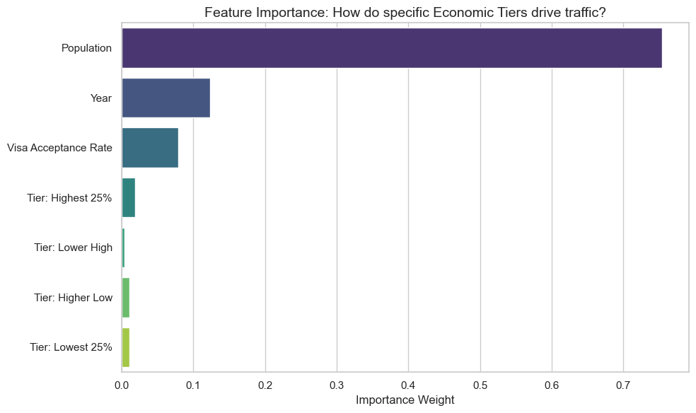

# DSA210 Term Project: Analyzing European Air Traffic Drivers
**Student:** Azize Keriman Kazdağlı  
**Course:** DSA 210 – Introduction to Data Science  
**Term:** Spring 2025-2026  

---

## 1. Introduction

### 1.1 Motivation
Air traffic is closely connected to economic development, population size, tourism, business activity, and international mobility. In Europe, countries differ significantly in their economic strength, demographic size, and travel conditions. These differences may help explain why some countries have higher inbound and outbound flight activity than others.

This project investigates whether European air traffic patterns can be explained using socio-economic indicators and Schengen visa statistics. By combining flight traffic data with GDP per capita, population, and visa acceptance rates, the project aims to identify the main factors associated with air traffic variation across European countries.

### 1.2 Objectives
* To process and clean European air traffic and Schengen visa statistics.
* To calculate visa acceptance rates from annual visa application and issued visa data.
* To merge flight traffic, population, GDP per capita, and visa-related variables into one dataset.
* To group countries into GDP-based economic tiers.
* To visualize the relationship between visa acceptance rate, GDP tier, and air traffic.
* To build machine learning models to predict outbound flights per capita.
* To identify the most important predictors of air traffic using feature importance analysis.

---

## 2. Data & Methodology

### 2.1 Data Sources
The dataset was constructed by combining three main types of data:

1. **European Air Traffic Data:**  
   The main dataset includes inbound and outbound flight traffic information for European countries. It also contains country-level variables such as population and GDP per capita.

2. **Schengen Visa Statistics:**  
   Annual Schengen visa statistics from 2016 to 2024 were used. These files include the number of visa applications and issued visas for Schengen countries. The data was used to calculate the visa acceptance rate.

3. **Economic and Demographic Data:**  
   GDP per capita and population variables were used to represent economic strength and demographic size. GDP per capita was also used to create economic clusters.

### 2.2 Data Processing Pipeline
* **Visa File Processing:** Multiple yearly Schengen visa Excel files were processed. For each year, the relevant country, visa applications, and issued visa columns were extracted.
* **Visa Acceptance Rate:** A new variable was calculated using the formula:

```text
Visa Acceptance Rate = (Visas Issued / Visa Applications) × 100
```

* **Country Name Standardization:** Country names were cleaned to improve merging accuracy. For example, `Czech Republic` was mapped to `Czechia`, and `Slovak Republic` was mapped to `Slovakia`.
* **Data Merging:** The visa dataset was merged with the main European air traffic dataset using `Country` and `Year`.
* **GDP Clustering:** Countries were grouped into four GDP-based clusters using GDP per capita quartiles:
  * Lowest 25%
  * Higher Low 25-50%
  * Lower High 50-75%
  * Highest 25%

---

## 3. Exploratory Data Analysis (EDA)

Before building machine learning models, visualizations were created to understand the relationship between visa acceptance rate, GDP tier, and air traffic activity.


*Figure 1: Relationship between visa acceptance rate and outbound flights per capita across GDP-based economic tiers.*

The scatter plot shows that visa acceptance rate alone does not fully explain outbound flights per capita. However, GDP-based grouping provides useful context. Higher-income groups generally show stronger outbound traffic per capita, while lower-income groups tend to have lower levels of outbound flight activity.


*Figure 2: Yearly trends of outbound traffic, inbound traffic, visa acceptance rate, and population by GDP tier.*

The timeline visualization shows how air traffic and related variables changed over time across GDP clusters. A clear decline appears around 2020, which is likely connected to COVID-19 travel restrictions. After 2021, flight traffic begins to recover. The graph also suggests that GDP tiers differ in their air traffic patterns, with higher economic groups generally maintaining stronger traffic activity per capita.

---

## 4. Hypothesis Testing and Interpretation

The main research question of this project is:

**To what extent do population, GDP per capita, and Schengen visa acceptance rates explain differences in European air traffic?**

### 4.1 Hypothesis
* **Null Hypothesis (H0):** Socio-economic and visa-related indicators do not have a meaningful relationship with outbound flights per capita.
* **Alternative Hypothesis (H1):** Socio-economic and visa-related indicators are related to outbound flights per capita.

### 4.2 Interpretation
The exploratory analysis suggests that air traffic differences cannot be explained by visa acceptance rate alone. Instead, the relationship becomes clearer when GDP-based economic tiers and population are considered. The visualizations indicate that higher GDP tiers generally have stronger air traffic per capita, while the machine learning results show that population is the most influential predictor.

Visa acceptance rate still provides useful context, but it should not be interpreted as the only driver of flight activity. This is because Schengen visa statistics only represent people who need visas, while many European citizens and residents can travel within Europe without applying for Schengen visas.

---

## 5. Machine Learning Analysis

Machine learning was used to move beyond visualization and test whether the selected variables can predict outbound flights per capita.

### 5.1 Models Used
The target variable was:

* `Outbound_Per_Capita`

The input features included:

* Population
* Year
* Visa Acceptance Rate
* GDP cluster dummy variables

The following models were tested:

* Mean Baseline
* Linear Regression
* K-Nearest Neighbors Regressor
* Random Forest Regressor

### 5.2 Model Performance


*Figure 3: R-squared score comparison of machine learning models.*

The Random Forest model achieved the best performance, with an R-squared score of approximately 0.81. This indicates that the selected features explain a large portion of the variation in outbound flights per capita. Linear Regression and KNN performed moderately, while the mean baseline performed poorly. This confirms that the selected socio-economic and visa-related variables contain meaningful predictive information.

### 5.3 Feature Importance


*Figure 4: Feature importance scores from the Random Forest model.*

The feature importance graph shows that **Population** is the strongest predictor of outbound flights per capita. Year is the second most important feature, which is reasonable because the dataset includes the COVID-19 period and the recovery period after travel restrictions. Visa acceptance rate also contributes to prediction, but less strongly than population and year. The GDP cluster variables have lower importance, suggesting that while GDP tiers are useful for interpretation, they are not the strongest predictors in the model.

---

## 6. Results and Discussion

The results show that European air traffic is influenced by multiple factors rather than one single variable. Population is the strongest predictor in the Random Forest model, indicating that demographic size is highly relevant for explaining air traffic patterns. Year also plays an important role, especially because 2020 and 2021 were affected by pandemic-related travel restrictions.

The visa acceptance rate is useful as a mobility-related indicator, but its predictive power is weaker than population and year. This result makes sense because Schengen visa statistics do not measure all travel demand. Many travelers in Europe do not need Schengen visas, so visa acceptance rate should be interpreted as a contextual variable rather than a complete measure of mobility.

GDP-based clustering helped compare countries at different economic levels. Higher GDP groups generally showed higher outbound traffic per capita in the visualizations. However, the machine learning results suggest that GDP tier alone does not fully explain flight activity. Air traffic is likely shaped by a combination of population, economic strength, tourism, geography, airline networks, and external disruptions such as COVID-19.

---

## 7. Limitations & Future Work

* **Aggregated Data:** The analysis uses country-level data. This means it does not capture individual travel behavior, city-level differences, or airport-level variation within countries.
* **Visa Data Limitation:** Schengen visa acceptance rates do not represent total travel demand, because many European citizens and residents can travel without applying for a Schengen visa.
* **COVID-19 Disruption:** The years 2020 and 2021 were strongly affected by pandemic-related travel restrictions. These years may distort long-term relationships between economic indicators and air traffic.
* **Missing Variables:** The dataset does not include several potentially important variables, such as tourism intensity, airline hub status, airport capacity, ticket prices, geographic location, or business travel demand.
* **Correlation vs. Causation:** The machine learning models identify predictive relationships, but they do not prove causation. For example, population may predict outbound traffic, but this does not necessarily mean population directly causes higher air traffic.
* **Future Work:** Future versions of the project could include airport-level data, tourism statistics, airline route networks, ticket price indicators, and longer time series data to improve prediction and interpretation.

---

## 8. AI Usage Disclaimer

In this project, I used AI tools to assist with:

1. **Coding Support:** Debugging Python errors, package installation issues, and notebook path problems.
2. **Writing Support:** Improving the structure and clarity of the README and final report.
3. **Project Organization:** Organizing documentation and preparing GitHub submission files.

All data processing, visualizations, machine learning outputs, and final interpretations were reviewed and validated manually.

---

## 9. References & Tools

* **Libraries:** `pandas`, `numpy`, `matplotlib`, `seaborn`, `openpyxl`, `scikit-learn`, `jupyter`.
* **Data:** European air traffic dataset, Schengen visa statistics from 2016 to 2024, GDP per capita, and population data.
* **Notebooks:** `data_process.ipynb`, `data_visualization.ipynb`, and `machine_learning.ipynb`.

---

## 10. Conclusion

This project analyzed European air traffic patterns using population, GDP per capita, and Schengen visa acceptance rates. The findings show that air traffic variation is shaped by a combination of socio-economic and mobility-related factors.

The Random Forest model performed the best, achieving an R-squared score of approximately 0.81. Feature importance analysis showed that population was the strongest predictor, followed by year and visa acceptance rate. GDP-based clusters were useful for comparing country groups, but they were less influential in the predictive model.

Overall, the project demonstrates that European air traffic cannot be explained by a single factor. Instead, it reflects the combined effects of demographic size, economic differences, visa-related mobility conditions, and major disruptions such as COVID-19. Future work could improve the analysis by including airport-level data, tourism statistics, airline hub information, and ticket price indicators.
